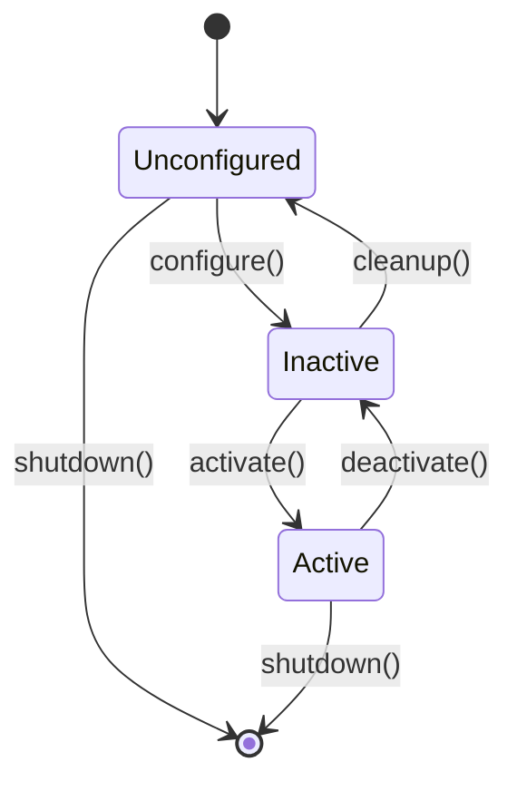

# ROS 2 Nodes and Topics - Deep Dive

## Understanding Nodes

In ROS 2, **nodes are the atomic units of computation**. Each node is a process that performs a specific task in your robot system.

### The Lifecycle of a Node

ROS 2 introduces **managed nodes** with explicit lifecycle states:



This allows for controlled startup and shutdown sequences, crucial for real robots.

### Creating a Lifecycle Node

```python
from rclpy.lifecycle import Node as LifecycleNode
from rclpy.lifecycle import TransitionCallbackReturn, State

class MyLifecycleNode(LifecycleNode):
    def __init__(self, node_name):
        super().__init__(node_name)
        
    def on_configure(self, state: State) -> TransitionCallbackReturn:
        self.get_logger().info('Configuring...')
        # Initialize resources (open files, connect to hardware)
        return TransitionCallbackReturn.SUCCESS
        
    def on_activate(self, state: State) -> TransitionCallbackReturn:
        self.get_logger().info('Activating...')
        # Start publishing/processing
        return super().on_activate(state)
        
    def on_deactivate(self, state: State) -> TransitionCallbackReturn:
        self.get_logger().info('Deactivating...')
        # Stop publishing/processing
        return super().on_deactivate(state)
        
    def on_cleanup(self, state: State) -> TransitionCallbackReturn:
        self.get_logger().info('Cleaning up...')
        # Release resources
        return TransitionCallbackReturn.SUCCESS
```

## Topics: The Data Highway

Topics implement the **Publisher-Subscriber** pattern, enabling:
- **Decoupling**: Publishers don't know who subscribes
- **Many-to-Many**: Multiple publishers and subscribers per topic
- **Asynchronous**: No blocking waits

### Common Message Types

#### Geometry Messages

```python
from geometry_msgs.msg import Twist, Pose, PoseStamped, Transform

# Velocity commands (for mobile robots)
cmd_vel = Twist()
cmd_vel.linear.x = 0.5   # m/s forward
cmd_vel.angular.z = 0.3  # rad/s turn

# Position and orientation
pose = Pose()
pose.position.x = 1.0
pose.position.y = 2.0
pose.position.z = 0.0
pose.orientation.w = 1.0  # Quaternion (no rotation)
```

#### Sensor Messages

```python
from sensor_msgs.msg import Image, LaserScan, Imu, JointState

# Camera image
image = Image()
image.height = 480
image.width = 640
image.encoding = "rgb8"
image.data = camera_data

# LiDAR scan
scan = LaserScan()
scan.angle_min = -3.14
scan.angle_max = 3.14
scan.range_min = 0.1
scan.range_max = 30.0
scan.ranges = distance_measurements

# IMU (Inertial Measurement Unit)
imu = Imu()
imu.linear_acceleration.x = accel_x
imu.angular_velocity.z = gyro_z
```

#### Standard Messages

```python
from std_msgs.msg import String, Int32, Float64, Bool, Header

# Simple data types
msg = String()
msg.data = "Hello, ROS 2!"

# Header (timestamp + frame info)
header = Header()
header.stamp = self.get_clock().now().to_msg()
header.frame_id = "base_link"
```

### Creating Custom Messages

For humanoid robots, you might need custom message types:

1. **Create message definition** (`my_robot_msgs/msg/JointCommand.msg`):

```
# JointCommand.msg
string joint_name
float64 position
float64 velocity
float64 effort
```

2. **Update `CMakeLists.txt`** (for C++) or **`package.xml`**:

```xml
<build_depend>rosidl_default_generators</build_depend>
<exec_depend>rosidl_default_runtime</exec_depend>
<member_of_group>rosidl_interface_packages</member_of_group>
```

3. **Use in Python**:

```python
from my_robot_msgs.msg import JointCommand

cmd = JointCommand()
cmd.joint_name = "left_elbow"
cmd.position = 1.57  # 90 degrees in radians
```

## Advanced Topic Patterns

### Time Synchronization

For sensor fusion, you need synchronized messages:

```python
from message_filters import Subscriber, ApproximateTimeSynchronizer
from sensor_msgs.msg import Image, CameraInfo

class SensorFusion(Node):
    def __init__(self):
        super().__init__('sensor_fusion')
        
        # Create subscribers with message_filters
        image_sub = Subscriber(self, Image, '/camera/image')
        depth_sub = Subscriber(self, Image, '/camera/depth')
        
        # Synchronize with approximate time matching
        self.sync = ApproximateTimeSynchronizer(
            [image_sub, depth_sub],
            queue_size=10,
            slop=0.1  # 100ms tolerance
        )
        self.sync.registerCallback(self.sync_callback)
        
    def sync_callback(self, image_msg, depth_msg):
        # Process synchronized RGB + Depth
        self.get_logger().info('Received synchronized frames')
```

### Transform Broadcasting (tf2)

For humanoid robots, tracking coordinate frames is essential:

```python
from tf2_ros import TransformBroadcaster, TransformListener, Buffer
from geometry_msgs.msg import TransformStamped

class TransformPublisher(Node):
    def __init__(self):
        super().__init__('transform_publisher')
        self.br = TransformBroadcaster(self)
        
    def publish_hand_transform(self):
        t = TransformStamped()
        t.header.stamp = self.get_clock().now().to_msg()
        t.header.frame_id = 'wrist'
        t.child_frame_id = 'hand'
        
        # Position
        t.transform.translation.x = 0.15
        t.transform.translation.y = 0.0
        t.transform.translation.z = 0.0
        
        # Orientation (quaternion)
        t.transform.rotation.w = 1.0
        
        self.br.sendTransform(t)
```

```python
class TransformListener(Node):
    def __init__(self):
        super().__init__('transform_listener')
        self.tf_buffer = Buffer()
        self.tf_listener = TransformListener(self.tf_buffer, self)
        
    def get_hand_in_world(self):
        try:
            # Look up transform from world to hand
            trans = self.tf_buffer.lookup_transform(
                'world',
                'hand',
                rclpy.time.Time()
            )
            return trans
        except Exception as e:
            self.get_logger().error(f'Transform lookup failed: {e}')
```

## Topic Performance Optimization

### Choosing the Right QoS

```python
from rclpy.qos import (
    QoSProfile,
    ReliabilityPolicy,
    HistoryPolicy,
    DurabilityPolicy,
    LivelinessPolicy
)

# High-frequency sensor data (LiDAR, camera)
sensor_qos = QoSProfile(
    reliability=ReliabilityPolicy.BEST_EFFORT,  # Drop if network congested
    history=HistoryPolicy.KEEP_LAST,
    depth=5,
    durability=DurabilityPolicy.VOLATILE
)

# Critical commands (must arrive)
command_qos = QoSProfile(
    reliability=ReliabilityPolicy.RELIABLE,  # Resend until acknowledged
    history=HistoryPolicy.KEEP_LAST,
    depth=10,
    durability=DurabilityPolicy.TRANSIENT_LOCAL
)

# Configuration (late joiners should receive)
config_qos = QoSProfile(
    reliability=ReliabilityPolicy.RELIABLE,
    history=HistoryPolicy.KEEP_LAST,
    depth=1,
    durability=DurabilityPolicy.TRANSIENT_LOCAL  # Store last message
)
```

### Message Throttling

Reduce message rate for bandwidth-limited scenarios:

```python
class ThrottledSubscriber(Node):
    def __init__(self):
        super().__init__('throttled_subscriber')
        self.last_process_time = self.get_clock().now()
        self.throttle_period = 0.1  # Process max 10 Hz
        
        self.subscription = self.create_subscription(
            Image,
            '/camera/image',
            self.image_callback,
            10
        )
        
    def image_callback(self, msg):
        current_time = self.get_clock().now()
        elapsed = (current_time - self.last_process_time).nanoseconds / 1e9
        
        if elapsed >= self.throttle_period:
            # Process the image
            self.process_image(msg)
            self.last_process_time = current_time
        # else: drop the message
```

## Practical Example: Humanoid Vision System

Here's a complete example of a vision processing node for humanoids:

```python
import rclpy
from rclpy.node import Node
from sensor_msgs.msg import Image, CameraInfo
from geometry_msgs.msg import PoseArray
from cv_bridge import CvBridge
import cv2
import numpy as np

class HumanoidVision(Node):
    def __init__(self):
        super().__init__('humanoid_vision')
        
        # CV Bridge for ROS <-> OpenCV conversion
        self.bridge = CvBridge()
        
        # Subscribers
        self.image_sub = self.create_subscription(
            Image,
            '/head_camera/image_raw',
            self.image_callback,
            10
        )
        
        self.camera_info_sub = self.create_subscription(
            CameraInfo,
            '/head_camera/camera_info',
            self.camera_info_callback,
            10
        )
        
        # Publishers
        self.detected_objects_pub = self.create_publisher(
            PoseArray,
            '/vision/detected_objects',
            10
        )
        
        self.debug_image_pub = self.create_publisher(
            Image,
            '/vision/debug_image',
            10
        )
        
        self.camera_matrix = None
        
    def camera_info_callback(self, msg):
        # Store camera intrinsics
        self.camera_matrix = np.array(msg.k).reshape(3, 3)
        
    def image_callback(self, msg):
        # Convert ROS Image to OpenCV format
        cv_image = self.bridge.imgmsg_to_cv2(msg, desired_encoding='bgr8')
        
        # Run object detection (simplified)
        detected_objects = self.detect_objects(cv_image)
        
        # Publish results
        pose_array = self.create_pose_array(detected_objects)
        self.detected_objects_pub.publish(pose_array)
        
        # Publish debug visualization
        debug_image = self.draw_detections(cv_image, detected_objects)
        debug_msg = self.bridge.cv2_to_imgmsg(debug_image, encoding='bgr8')
        debug_msg.header = msg.header
        self.debug_image_pub.publish(debug_msg)
        
    def detect_objects(self, image):
        # Placeholder for actual detection (YOLO, etc.)
        # Returns list of bounding boxes
        return []
        
    def create_pose_array(self, detections):
        pose_array = PoseArray()
        pose_array.header.stamp = self.get_clock().now().to_msg()
        pose_array.header.frame_id = 'head_camera'
        # Add poses for detected objects
        return pose_array
        
    def draw_detections(self, image, detections):
        # Draw bounding boxes on image
        return image

def main(args=None):
    rclpy.init(args=args)
    node = HumanoidVision()
    try:
        rclpy.spin(node)
    except KeyboardInterrupt:
        pass
    finally:
        node.destroy_node()
        rclpy.shutdown()

if __name__ == '__main__':
    main()
```

## Debugging Topics

### Command-Line Tools

```bash
# List all topics
ros2 topic list

# Show topic information (type, publishers, subscribers)
ros2 topic info /cmd_vel

# Echo messages in real-time
ros2 topic echo /camera/image

# Show message rate
ros2 topic hz /camera/image

# Publish a message manually
ros2 topic pub /cmd_vel geometry_msgs/msg/Twist "{linear: {x: 0.5}, angular: {z: 0.0}}"

# Show topic bandwidth
ros2 topic bw /camera/image
```

### Using rqt_graph

Visualize node and topic connections:

```bash
rqt_graph
```

This shows a live graph of:
- Active nodes (ovals)
- Topics (rectangles)
- Connections between them

## Best Practices

> [!TIP]
> **Use Descriptive Topic Names**: Follow the pattern `/robot_name/sensor_type/data_type`
> Example: `/humanoid/head_camera/image_raw`

> [!WARNING]
> **Avoid Large Messages at High Frequency**: Sending 4K images at 60Hz will overwhelm most networks. Compress or throttle as needed.

> [!IMPORTANT]
> **Always Add Timestamps**: Include proper timestamps in message headers for time synchronization and logging.

## Next Steps

- **[URDF Robot Description](urdf.md)** - Learn how to describe your humanoid robot's structure
- **[Module 2: Gazebo](../module2-gazebo/overview.md)** - Simulate your robot in a physics engine

## Resources

- [ROS 2 Node Documentation](https://docs.ros.org/en/humble/Concepts/About-Nodes.html)
- [Common Interfaces](https://github.com/ros2/common_interfaces)
- [Quality of Service](https://docs.ros.org/en/humble/Concepts/About-Quality-of-Service-Settings.html)
- [tf2 Tutorials](https://docs.ros.org/en/humble/Tutorials/Intermediate/Tf2/Tf2-Main.html)
