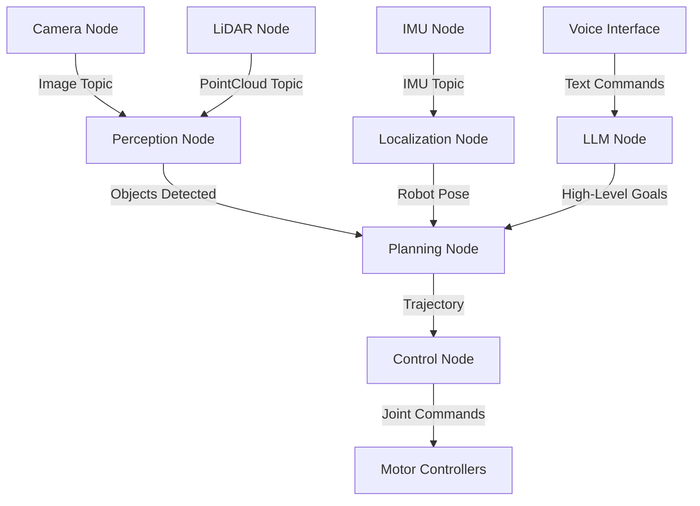

# Module 1: The Robotic Nervous System (ROS 2)

## Overview

Robot Operating System 2 (ROS 2) is the industry-standard middleware for building robot applications. Just as the nervous system coordinates signals between the brain and body, ROS 2 coordinates communication between different components of a robot system.

## What is ROS 2?

ROS 2 is **not an operating system** in the traditional sense. Instead, it's a flexible framework and set of tools that provide:

- **Communication Infrastructure**: Standardized message passing between components
- **Hardware Abstraction**: Write code once, deploy to different robots
- **Tool Ecosystem**: Visualization, debugging, and simulation tools
- **Community Libraries**: Thousands of packages for common robotics tasks

### Why ROS 2 (vs ROS 1)?

ROS 2 was built from the ground up to address critical limitations:

| Feature | ROS 1 | ROS 2 |
|---------|-------|-------|
| **Real-time** | Limited | Full real-time support |
| **Security** | None | DDS security built-in |
| **Multi-robot** | Difficult | Native support |
| **Platforms** | Linux only | Linux, Windows, macOS |
| **Production Ready** | Research-focused | Industrial deployment |

## Core Concepts

### 1. Nodes

A **node** is a single-purpose executable that performs computation. Think of nodes as independent workers in your robot system.

```python
import rclpy
from rclpy.node import Node

class MinimalNode(Node):
    def __init__(self):
        super().__init__('minimal_node')
        self.get_logger().info('Hello from ROS 2!')

def main(args=None):
    rclpy.init(args=args)
    node = MinimalNode()
    rclpy.spin(node)
    rclpy.shutdown()

if __name__ == '__main__':
    main()
```

**Key Principles**:
- Each node should have a single, well-defined purpose
- Nodes run independently and can be started/stopped individually
- Nodes communicate via topics, services, and actions

### 2. Topics (Publisher-Subscriber Pattern)

Topics enable **asynchronous, many-to-many communication**. Perfect for continuous data streams like sensor readings.

```python
from geometry_msgs.msg import Twist

class VelocityPublisher(Node):
    def __init__(self):
        super().__init__('velocity_publisher')
        self.publisher = self.create_publisher(Twist, 'cmd_vel', 10)
        self.timer = self.create_timer(0.1, self.publish_velocity)
        
    def publish_velocity(self):
        msg = Twist()
        msg.linear.x = 0.5  # Move forward
        msg.angular.z = 0.0  # No rotation
        self.publisher.publish(msg)
```

```python
class VelocitySubscriber(Node):
    def __init__(self):
        super().__init__('velocity_subscriber')
        self.subscription = self.create_subscription(
            Twist,
            'cmd_vel',
            self.velocity_callback,
            10)
        
    def velocity_callback(self, msg):
        self.get_logger().info(f'Received: linear={msg.linear.x}, angular={msg.angular.z}')
```

### 3. Services (Request-Response Pattern)

Services provide **synchronous, one-to-one communication**. Use for discrete actions that require confirmation.

```python
from example_interfaces.srv import AddTwoInts

class ServiceServer(Node):
    def __init__(self):
        super().__init__('add_two_ints_server')
        self.srv = self.create_service(AddTwoInts, 'add_two_ints', self.add_callback)
        
    def add_callback(self, request, response):
        response.sum = request.a + request.b
        self.get_logger().info(f'Incoming: {request.a} + {request.b} = {response.sum}')
        return response
```

### 4. Actions (Long-Running Tasks)

Actions handle **long-running operations** with feedback. Ideal for navigation, manipulation, etc.

```python
from action_msgs.msg import GoalStatus
from nav2_msgs.action import NavigateToPose

class NavigationActionClient(Node):
    def __init__(self):
        super().__init__('navigation_client')
        self._action_client = ActionClient(self, NavigateToPose, 'navigate_to_pose')
        
    def send_goal(self, x, y):
        goal_msg = NavigateToPose.Goal()
        goal_msg.pose.pose.position.x = x
        goal_msg.pose.pose.position.y = y
        
        self._action_client.wait_for_server()
        self._send_goal_future = self._action_client.send_goal_async(
            goal_msg,
            feedback_callback=self.feedback_callback)
            
    def feedback_callback(self, feedback_msg):
        feedback = feedback_msg.feedback
        self.get_logger().info(f'Distance remaining: {feedback.distance_remaining}')
```

## ROS 2 Architecture for Humanoid Robots

For a humanoid robot, your ROS 2 system might look like:



## Key Tools

### Command Line Tools

```bash
# List all active nodes
ros2 node list

# See topics being published
ros2 topic list

# Echo messages on a topic
ros2 topic echo /cmd_vel

# Show node information
ros2 node info /my_node

# Record data to a bag file
ros2 bag record -a

# Play back recorded data
ros2 bag play my_bag
```

### Visualization: RViz2

RViz2 is the primary 3D visualization tool for ROS 2:
- Visualize robot models (URDF)
- Display sensor data (camera, LiDAR, depth)
- Show planned paths and trajectories
- Monitor transforms between coordinate frames

### Introspection: rqt

rqt provides GUI tools for:
- **rqt_graph**: Visualize node/topic connections
- **rqt_console**: Monitor log messages
- **rqt_plot**: Plot data from topics in real-time
- **rqt_reconfigure**: Dynamically adjust parameters

## Quality of Service (QoS)

ROS 2 uses DDS (Data Distribution Service) which allows fine control over message delivery:

```python
from rclpy.qos import QoSProfile, ReliabilityPolicy, HistoryPolicy

# For sensor data (best effort, drop old messages)
sensor_qos = QoSProfile(
    reliability=ReliabilityPolicy.BEST_EFFORT,
    history=HistoryPolicy.KEEP_LAST,
    depth=10
)

# For critical commands (reliable, don't drop)
command_qos = QoSProfile(
    reliability=ReliabilityPolicy.RELIABLE,
    history=HistoryPolicy.KEEP_LAST,
    depth=10
)

self.publisher = self.create_publisher(Twist, 'cmd_vel', sensor_qos)
```

## Package Structure

A typical ROS 2 Python package:

```
my_robot_package/
├── package.xml          # Package metadata
├── setup.py            # Python package setup
├── setup.cfg           # Configuration
├── resource/           # Package marker
├── my_robot_package/
│   ├── __init__.py
│   ├── my_node.py     # Node implementation
│   └── utils.py       # Helper functions
└── test/              # Unit tests
```

### Creating a Package

```bash
# Create a workspace
mkdir -p ~/ros2_ws/src
cd ~/ros2_ws/src

# Create a Python package
ros2 pkg create --build-type ament_python my_robot_package

# Build the workspace
cd ~/ros2_ws
colcon build

# Source the workspace
source install/setup.bash

# Run your node
ros2 run my_robot_package my_node
```

## Launch Files

Launch files start multiple nodes with configuration:

```python
from launch import LaunchDescription
from launch_ros.actions import Node

def generate_launch_description():
    return LaunchDescription([
        Node(
            package='my_robot_package',
            executable='camera_node',
            name='camera',
            parameters=[{'frame_rate': 30}]
        ),
        Node(
            package='my_robot_package',
            executable='perception_node',
            name='perception',
            remappings=[('/input_image', '/camera/image_raw')]
        ),
    ])
```

```bash
ros2 launch my_robot_package robot_launch.py
```

## Best Practices

> [!TIP]
> **Keep Nodes Small and Focused**: Each node should do one thing well. This makes debugging easier and promotes code reuse.

> [!WARNING]
> **Avoid Blocking Operations**: ROS 2 uses callbacks. Never block in a callback as it will prevent other callbacks from executing.

> [!IMPORTANT]
> **Use Namespaces**: When running multiple robots, use namespaces to avoid topic/service collisions:
> ```bash
> ros2 run my_package my_node --ros-args -r __ns:=/robot1
> ```

## Next Steps

Now that you understand ROS 2 fundamentals, dive deeper into:

1. **[Nodes and Topics](nodes-topics.md)** - Detailed communication patterns
2. **[URDF Robot Description](urdf.md)** - Defining your humanoid robot structure

## Resources

- **Official Documentation**: [docs.ros.org](https://docs.ros.org/en/humble/)
- **ROS 2 Tutorials**: [ROS 2 Humble Tutorials](https://docs.ros.org/en/humble/Tutorials.html)
- **Community**: [ROS Discourse](https://discourse.ros.org/)

---

**Next Module**: [Module 2: The Digital Twin (Gazebo)](../module2-gazebo/overview.md)