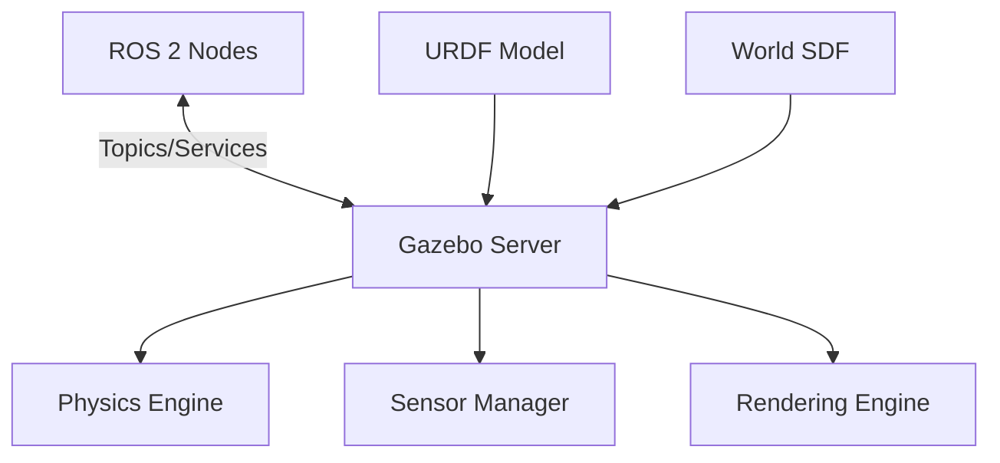

# Module 2: The Digital Twin - Gazebo Simulation

## Overview

Before deploying code to expensive hardware, we test in **simulation**. Gazebo is the industry-standard physics simulator for robotics that provides:

- **Realistic Physics**: Gravity, friction, collisions, inertia
- **Sensor Simulation**: Cameras, LiDAR, IMU, force/torque sensors
- **ROS 2 Integration**: Seamless communication with ROS 2 nodes
- **Environment Building**: Create custom worlds for testing

## What is a Digital Twin?

A **digital twin** is a virtual representation of a physical robot that:
- ✅ Behaves identically to the real robot within simulation constraints
- ✅ Uses the exact same control code as the real robot
- ✅ Provides a safe environment for testing dangerous scenarios
- ✅ Enables rapid iteration without hardware damage

## Why Simulation Matters for Humanoid Robots

Humanoid robots are:
- **Expensive** ($10k - $100k+)
- **Fragile** when testing unknown behaviors
- **Slow to iterate** on physical hardware
- **Dangerous** if control algorithms fail

Simulation allows us to:
- Test thousands of scenarios overnight
- Train reinforcement learning agents safely
- Debug perception and planning algorithms
- Develop without physical hardware access

## Gazebo Architecture



## Installing Gazebo with ROS 2

```bash
# Install Gazebo Harmonic (latest)
sudo apt install ros-humble-gazebo-ros-pkgs

# Install additional tools
sudo apt install ros-humble-gazebo-ros2-control
sudo apt install ros-humble-ros-gz-bridge

# Test installation
gz sim
```

## Creating Your First World

Create a simple world file (`empty_world.sdf`):

```xml
<?xml version="1.0"?>
<sdf version="1.9">
  <world name="empty_world">
    
    <!-- Physics settings -->
    <physics name="1ms" type="ignored">
      <max_step_size>0.001</max_step_size>
      <real_time_factor>1.0</real_time_factor>
    </physics>
    
    <!-- Lighting -->
    <light type="directional" name="sun">
      <cast_shadows>true</cast_shadows>
      <pose>0 0 10 0 0 0</pose>
      <diffuse>0.8 0.8 0.8 1</diffuse>
      <specular>0.2 0.2 0.2 1</specular>
      <attenuation>
        <range>1000</range>
      </attenuation>
      <direction>-0.5 0.1 -0.9</direction>
    </light>
    
    <!-- Ground plane -->
    <model name="ground_plane">
      <static>true</static>
      <link name="link">
        <collision name="collision">
          <geometry>
            <plane>
              <normal>0 0 1</normal>
            </plane>
          </geometry>
        </collision>
        <visual name="visual">
          <geometry>
            <plane>
              <normal>0 0 1</normal>
              <size>100 100</size>
            </plane>
          </geometry>
          <material>
            <ambient>0.8 0.8 0.8 1</ambient>
            <diffuse>0.8 0.8 0.8 1</diffuse>
          </material>
        </visual>
      </link>
    </model>
    
  </world>
</sdf>
```

Launch it with:
```bash
gz sim empty_world.sdf
```

## Spawning a Humanoid Robot

### 1. Create Gazebo Launch File

```python
from launch import LaunchDescription
from launch.actions import IncludeLaunchDescription
from launch_ros.actions import Node
from ament_index_python.packages import get_package_share_directory
import os

def generate_launch_description():
    pkg_share = get_package_share_directory('my_humanoid')
    urdf_file = os.path.join(pkg_share, 'urdf', 'humanoid.urdf')
    world_file = os.path.join(pkg_share, 'worlds', 'empty.world')
    
    return LaunchDescription([
        # Start Gazebo
        IncludeLaunchDescription(
            os.path.join(
                get_package_share_directory('gazebo_ros'),
                'launch',
                'gazebo.launch.py'
            ),
            launch_arguments={'world': world_file}.items()
        ),
        
        # Spawn robot
        Node(
            package='gazebo_ros',
            executable='spawn_entity.py',
            arguments=[
                '-entity', 'humanoid',
                '-file', urdf_file,
                '-x', '0',
                '-y', '0',
                '-z', '1.0'
            ],
            output='screen'
        ),
        
        # Robot state publisher
        Node(
            package='robot_state_publisher',
            executable='robot_state_publisher',
            parameters=[{'robot_description': open(urdf_file).read()}]
        ),
    ])
```

## Physics Simulation

### Gravity and Forces

```xml
<!-- In your SDF world file -->
<physics name="default_physics">
  <max_step_size>0.001</max_step_size>
  <real_time_factor>1.0</real_time_factor>
  <gravity>0 0 -9.81</gravity>  <!-- Earth gravity -->
</physics>
```

### Contact and Friction

```xml
<gazebo reference="foot_link">
  <mu1>0.8</mu1>  <!-- Friction coefficient direction 1 -->
  <mu2>0.8</mu2>  <!-- Friction coefficient direction 2 -->
  <kp>1000000.0</kp>  <!-- Contact stiffness -->
  <kd>100.0</kd>  <!-- Contact damping -->
  <minDepth>0.001</minDepth>
  <maxVel>0.1</maxVel>
  <material>Gazebo/Grey</material>
</gazebo>
```

## Adding Control to Your Robot

### ros2_control Integration

```xml
<ros2_control name="GazeboSystem" type="system">
  <hardware>
    <plugin>gazebo_ros2_control/GazeboSystem</plugin>
  </hardware>
  
  <joint name="left_knee">
    <command_interface name="position">
      <param name="min">0</param>
      <param name="max">2.356</param>
    </command_interface>
    <state_interface name="position"/>
    <state_interface name="velocity"/>
    <state_interface name="effort"/>
  </joint>
  
  <!-- Repeat for other joints -->
</ros2_control>
```

### Position Controller

```yaml
# config/controllers.yaml
controller_manager:
  ros__parameters:
    update_rate: 100
    
    joint_state_broadcaster:
      type: joint_state_broadcaster/JointStateBroadcaster
      
    position_controller:
      type: position_controllers/JointGroupPositionController
      
position_controller:
  ros__parameters:
    joints:
      - left_shoulder
      - left_elbow
      - right_shoulder
      - right_elbow
      - left_hip
      - left_knee
      - right_hip
      - right_knee
```

## Advanced Features

### Plugin System

Gazebo uses plugins to extend functionality:

```cpp
// Custom sensor plugin example
class MyCustomSensor : public gazebo::SensorPlugin {
public:
  void Load(gazebo::sensors::SensorPtr _sensor, sdf::ElementPtr _sdf) {
    // Initialize sensor
  }
  
  void OnUpdate() {
    // Process sensor data
    // Publish to ROS 2
  }
};
```

### ROS 2 Gazebo Bridge

```python
# Bridge Gazebo topics to ROS 2
from gz_import ros2_control_demo_bringup import GazeboRosBridge

class GazeboBridgeNode(Node):
    def __init__(self):
        super().__init__('gazebo_bridge')
        
        # Bridge camera images
        self.create_subscription(
            Image,
            '/gazebo/camera/image',
            self.image_callback,
            10
        )
```

## Environment Building

### Adding Objects

```xml
<model name="table">
  <static>true</static>
  <pose>1 0 0 0 0 0</pose>
  <link name="link">
    <collision name="collision">
      <geometry>
        <box>
          <size>0.8 1.2 0.8</size>
        </box>
      </geometry>
    </collision>
    <visual name="visual">
      <geometry>
        <box>
          <size>0.8 1.2 0.8</size>
        </box>
      </geometry>
      <material>
        <ambient>0.5 0.3 0.1 1</ambient>
      </material>
    </visual>
  </link>
</model>
```

### Model Database

Use pre-built models:
```bash
# Access Gazebo model database
gz model --list

# Download a model
gz model --download chair
```

## Unity Alternative

For high-fidelity visualization and human-robot interaction:

### Unity Robotics Hub

- **Better graphics** than Gazebo
- **VR/AR integration** for telepresence
- **Human animation** mocap data
- **Cross-platform** (Windows, Mac, Linux)

```bash
# Install Unity Robotics packages
# Follow: https://github.com/Unity-Technologies/Unity-Robotics-Hub
```

## Performance Optimization

> [!TIP]
> **Simplify Collision Meshes**: Use primitive shapes (boxes, cylinders) instead of complex meshes for collision detection.

> [!WARNING]
> **Watch Your Physics Step Size**: Smaller steps (0.001s) are more accurate but slower. Balance accuracy vs. speed.

> [!IMPORTANT]
> **Real-Time Factor**: If RTF < 1.0, your simulation is running slower than real-time. Simplify your model or reduce sensor update rates.

## Debugging Tools

```bash
# Monitor gazebo performance
gz stats

# Introspect topics
gz topic -l
gz topic -e -t /world/default/stats

# Check model info
gz model -m humanoid -i
```

## Next Steps

- **[Sensor Simulation](sensors.md)** - Add cameras, LiDAR, and IMUs
- **[Module 3: NVIDIA Isaac](../module3-isaac/overview.md)** - Advanced AI-powered simulation

## Resources

- [Gazebo Official Docs](https://gazebosim.org/docs)
- [ROS 2 Gazebo Integration](https://docs.ros.org/en/humble/Tutorials/Advanced/Simulators/Gazebo/Gazebo.html)
- [ros2_control](https://control.ros.org/master/index.html)
- [Unity Robotics Hub](https://github.com/Unity-Technologies/Unity-Robotics-Hub)
