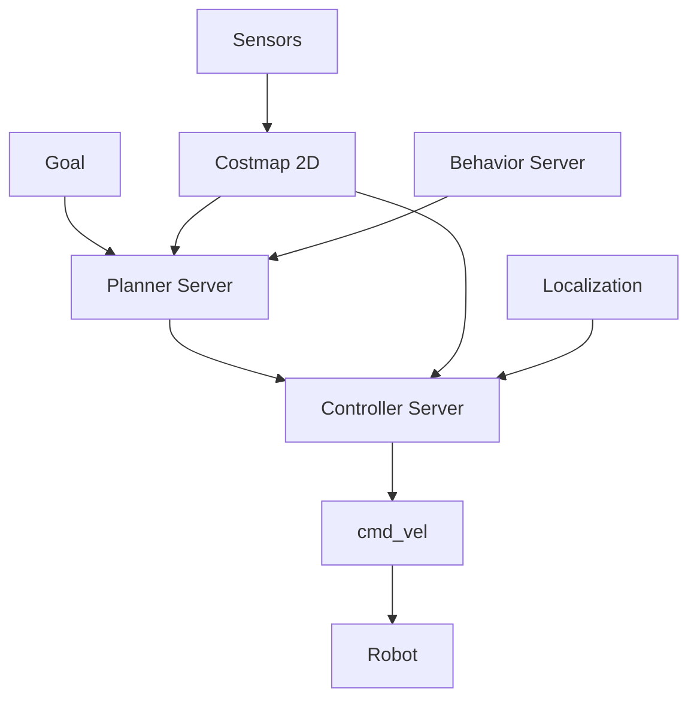

# Navigation with Nav2

## Overview

**Nav2** (Navigation 2) is the ROS 2 navigation stack that enables autonomous mobile robot navigation. For humanoid robots, it provides:

- **Path Planning**: Find collision-free paths to goals
- **Costmap Generation**: Build 2D/3D maps from sensors
- **Behavior Trees**: Complex navigation behaviors
- **Recovery Behaviors**: Handle failures gracefully

## Architecture



## Installing Nav2

```bash
sudo apt install ros-humble-navigation2 ros-humble-nav2-bringup
sudo apt install ros-humble-turtlebot3-*  # Example configs
```

## Configuring Nav2 for Humanoids

### 1. Costmap Configuration

```yaml
# costmap_common.yaml
global_costmap:
  global_frame: map
  robot_base_frame: base_link
  update_frequency: 1.0
  publish_frequency: 1.0
  width: 25
  height: 25
  resolution: 0.05
  
  plugins:
    - "static_layer"
    - "obstacle_layer"
    - "inflation_layer"
    
  static_layer:
    plugin: "nav2_costmap_2d::StaticLayer"
    map_subscribe_transient_local: True
    
  obstacle_layer:
    plugin: "nav2_costmap_2d::ObstacleLayer"
    enabled: True
    observation_sources: scan
    scan:
      topic: /scan
      max_obstacle_height: 2.0
      clearing: True
      marking: True
      
  inflation_layer:
    plugin: "nav2_costmap_2d::InflationLayer"
    cost_scaling_factor: 3.0
    inflation_radius: 0.55  # Humanoid footprint

local_costmap:
  local_frame: odom
  robot_base_frame: base_link
  update_frequency: 5.0
  publish_frequency: 2.0
  width: 3
  height: 3
  resolution: 0.05
  rolling_window: true
```

### 2. Planner Configuration

```yaml
# planner_server.yaml
planner_server:
  ros__parameters:
    expected_planner_frequency: 20.0
    planner_plugins: ["GridBased"]
    
    GridBased:
      plugin: "nav2_navfn_planner/NavfnPlanner"
      tolerance: 0.5
      use_astar: false
      allow_unknown: true
```

### 3. Controller Configuration

For humanoids, use DWB (Dynamic Window Approach):

```yaml
# controller.yaml
controller_server:
  ros__parameters:
    controller_frequency: 20.0
    min_x_velocity_threshold: 0.001
    min_y_velocity_threshold: 0.001
    min_theta_velocity_threshold: 0.001
    
    FollowPath:
      plugin: "dwb_core::DWBLocalPlanner"
      
      # Humanoid-specific constraints
      min_vel_x: 0.0
      max_vel_x: 0.3  # Slow walking
      max_vel_y: 0.0  # No strafing (non-holonomic)
      max_vel_theta: 0.5
      
      min_speed_xy: 0.0
      max_speed_xy: 0.3
      min_speed_theta: 0.0
      
      acc_lim_x: 0.25
      acc_lim_y: 0.0
      acc_lim_theta: 0.3
      decel_lim_x: -0.25
      decel_lim_y: 0.0
      decel_lim_theta: -0.3
      
      vx_samples: 20
      vy_samples: 0
      vth_samples: 40
      
      # Trajectory scoring
      critics:
        - "RotateToGoal"
        - "Oscillation"
        - "BaseObstacle"
        - "GoalAlign"
        - "PathAlign"
        - "PathDist"
        - "GoalDist"
```

## Implementing Bipedal Locomotion

### Footstep Planner

For true bipedal walking:

```python
from geometry_msgs.msg import PoseStamped
from nav_msgs.msg import Path

class FootstepPlanner(Node):
    def __init__(self):
        super().__init__('footstep_planner')
        
        self.path_sub = self.create_subscription(
            Path,
            '/plan',
            self.path_callback,
            10
        )
        
        self.footstep_pub = self.create_publisher(
            FootstepArray,  # Custom message
            '/footsteps',
            10
        )
        
    def path_callback(self, path_msg):
        # Convert continuous path to discrete footsteps
        footsteps = self.discretize_path(path_msg)
        
        # Ensure alternating feet
        footsteps = self.alternate_feet(footsteps)
        
        # Check stability
        footsteps = self.ensure_stability(footsteps)
        
        self.footstep_pub.publish(footsteps)
        
    def discretize_path(self, path):
        # Convert path waypoints to foot placements
        step_length = 0.3  # 30cm per step
        footsteps = []
        
        for i in range(0, len(path.poses), step_length):
            pose = path.poses[i]
            footsteps.append(Footstep(
                pose=pose,
                foot='left' if i % 2 == 0 else 'right'
            ))
        
        return footsteps
```

### Balance Controller

Integrate with whole-body control:

```python
import numpy as np
from scipy.spatial.transform import Rotation

class BalanceController(Node):
    def __init__(self):
        super().__init__('balance_controller')
        
        # Subscribe to IMU for balance
        self.imu_sub = self.create_subscription(
            Imu,
            '/humanoid/imu',
            self.imu_callback,
            10
        )
        
        # Publish joint commands
        self.joint_pub = self.create_publisher(
            JointTrajectory,
            '/joint_trajectory_controller/joint_trajectory',
            10
        )
        
        # PID controller for balance
        self.pid_roll = PID(kp=2.0, ki=0.1, kd=0.5)
        self.pid_pitch = PID(kp=2.0, ki=0.1, kd=0.5)
        
    def imu_callback(self, imu_msg):
        # Get orientation
        quat = [imu_msg.orientation.x, imu_msg.orientation.y, 
                imu_msg.orientation.z, imu_msg.orientation.w]
        
        r = Rotation.from_quat(quat)
        roll, pitch, yaw = r.as_euler('xyz')
        
        # Calculate correction
        ankle_roll_correction = self.pid_roll.update(roll, dt=0.01)
        ankle_pitch_correction = self.pid_pitch.update(pitch, dt=0.01)
        
        # Apply to ankle joints
        self.apply_ankle_correction(ankle_roll_correction, ankle_pitch_correction)
```

## Using Isaac ROS for VSLAM

Integrate hardware-accelerated VSLAM:

```python
from launch import LaunchDescription
from launch_ros.actions import Node

def generate_launch_description():
    return LaunchDescription([
        # Isaac ROS Visual SLAM
        Node(
            package='isaac_ros_visual_slam',
            executable='isaac_ros_visual_slam',
            name='visual_slam',
            parameters=[{
                'enable_imu_fusion': True,
                'publish_odom_to_base_tf': True,
                'publish_map_to_odom_tf': True,
            }],
            remappings=[
                ('visual_slam/image_0', '/humanoid/camera/left/image_raw'),
                ('visual_slam/camera_info_0', '/humanoid/camera/left/camera_info'),
                ('visual_slam/image_1', '/humanoid/camera/right/image_raw'),
                ('visual_slam/camera_info_1', '/humanoid/camera/right/camera_info'),
                ('visual_slam/imu', '/humanoid/imu'),
            ]
        ),
        
        # Nav2
        Node(
            package='nav2_bringup',
            executable='bringup_launch.py',
            name='navigation',
            parameters=[{
                'use_sim_time': True,
                'autostart': True,
            }]
        )
    ])
```

## Obstacle Avoidance

Dynamic obstacle handling:

```python
from sensor_msgs.msg import LaserScan
from geometry_msgs.msg import Twist

class ObstacleAvoider(Node):
    def __init__(self):
        super().__init__('obstacle_avoider')
        
        self.scan_sub = self.create_subscription(
            LaserScan,
            '/scan',
            self.scan_callback,
            10
        )
        
        self.cmd_override_pub = self.create_publisher(
            Twist,
            '/cmd_vel_override',
            10
        )
        
    def scan_callback(self, scan_msg):
        # Find minimum distance in front
        front_angles = range(len(scan_msg.ranges) // 3, 
                            2 * len(scan_msg.ranges) // 3)
        front_distances = [scan_msg.ranges[i] for i in front_angles]
        min_dist = min(front_distances)
        
        # Emergency stop if too close
        if min_dist < 0.3:
            self.get_logger().warn(f'OBSTACLE! Distance: {min_dist:.2f}m')
            
            stop_cmd = Twist()
            stop_cmd.linear.x = 0.0
            stop_cmd.angular.z = 0.0
            self.cmd_override_pub.publish(stop_cmd)
```

## Launch Nav2 for Humanoid

```python
# nav2_humanoid_launch.py
from launch import LaunchDescription
from launch_ros.actions import Node
from ament_index_python.packages import get_package_share_directory
import os

def generate_launch_description():
    pkg_dir = get_package_share_directory('humanoid_navigation')
    
    return LaunchDescription([
        # Map server
        Node(
            package='nav2_map_server',
            executable='map_server',
            name='map_server',
            parameters=[{'yaml_filename': os.path.join(pkg_dir, 'maps', 'lab.yaml')}]
        ),
        
        # Localization (AMCL)
        Node(
            package='nav2_amcl',
            executable='amcl',
            name='amcl',
            parameters=[os.path.join(pkg_dir, 'config', 'amcl.yaml')]
        ),
        
        # Lifecycle manager
        Node(
            package='nav2_lifecycle_manager',
            executable='lifecycle_manager',
            name='lifecycle_manager',
            parameters=[{
                'autostart': True,
                'node_names': ['map_server', 'amcl']
            }]
        )
    ])
```

## Testing Navigation

```bash
# Launch Nav2
ros2 launch humanoid_navigation nav2_humanoid_launch.py

# Send a goal via command line
ros2 topic pub --once /goal_pose geometry_msgs/PoseStamped \
  "{header: {frame_id: 'map'}, pose: {position: {x: 2.0, y: 1.0, z: 0.0}, orientation: {w: 1.0}}}"

# Or use RViz2
rviz2 -d $(ros2 pkg prefix humanoid_navigation)/config/nav2.rviz
```

In RViz2, use "2D Goal Pose" tool to click a destination.

## Next Steps

- **[Module 4: VLA Overview](../module4-vla/overview.md)** - NaturalLanguage commands for navigation
- Practice: Implement waypoint following
- Advanced: Multi-floor navigation with elevators

## Resources

- [Nav2 Documentation](https://navigation.ros.org/)
- [Isaac ROS Visual SLAM](https://nvidia-isaac-ros.github.io/concepts/visual_slam/index.html)
- [Humanoid Locomotion Papers](https://arxiv.org/abs/2304.13653)
