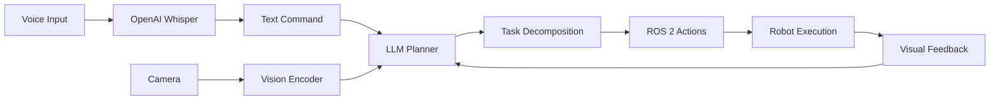

# Module 4: Vision-Language-Action (VLA)

## Overview

**Vision-Language-Action (VLA)** models represent the convergence of:
- **Vision**: Understanding the world through cameras
- **Language**: Natural communication with humans
- **Action**: Executing physical tasks

This enables robots to understand commands like *"Pick up the red cup on the table"* and translate them into motor commands.

## The VLA Revolution

Traditional robotics required:
- ❌ Hand-coded state machines for every task
- ❌ Explicit object detection and manipulation pipelines
- ❌ Complex behavior trees

VLA models enable:
- ✅ **Natural language commands** → robot actions
- ✅ **Foundation models** trained on internet-scale data
- ✅ **Few-shot learning** - adapt to new tasks quickly
- ✅ **Multimodal understanding** - vision + language together

## Architecture



## Components

### 1. Voice Interface (OpenAI Whisper)

Convert speech to text:

```python
import whisper
from sensor_msgs.msg import Audio
import numpy as np

class VoiceInterface(Node):
    def __init__(self):
        super().__init__('voice_interface')
        
        # Load Whisper model
        self.model = whisper.load_model("base")  # or "medium", "large"
        
        # Subscribe to microphone
        self.audio_sub = self.create_subscription(
            Audio,
            '/audio/input',
            self.audio_callback,
            10
        )
        
        # Publish transcribed commands
        self.command_pub = self.create_publisher(
            String,
            '/voice_commands',
            10
        )
        
        self.audio_buffer = []
        
    def audio_callback(self, msg):
        self.audio_buffer.extend(msg.data)
        
        # Process every 3 seconds of audio
        if len(self.audio_buffer) >= 48000 * 3:  # 48kHz * 3s
            self.process_audio()
            self.audio_buffer = []
            
    def process_audio(self):
        # Convert to numpy array
        audio_np = np.array(self.audio_buffer, dtype=np.float32)
        
        # Transcribe with Whisper
        result = self.model.transcribe(audio_np)
        text = result["text"]
        
        self.get_logger().info(f'Heard: "{text}"')
        
        # Publish command
        msg = String()
        msg.data = text
        self.command_pub.publish(msg)
```

### 2. LLM-Based Task Planner

Use GPT-4 to decompose tasks:

```python
from openai import OpenAI
from std_msgs.msg import String

class TaskPlanner(Node):
    def __init__(self):
        super().__init__('task_planner')
        
        # Initialize OpenAI client
        self.client = OpenAI(api_key="your-api-key")
        
        # Subscribe to voice commands
        self.command_sub = self.create_subscription(
            String,
            '/voice_commands',
            self.command_callback,
            10
        )
        
        # Publish action sequence
        self.action_pub = self.create_publisher(
            ActionSequence,  # Custom message
            '/robot/actions',
            10
        )
        
    def command_callback(self, msg):
        command = msg.data
        
        # Get robot capabilities
        capabilities = self.get_robot_capabilities()
        
        # Query LLM for plan
        plan = self.generate_plan(command, capabilities)
        
        # Execute plan
        self.execute_plan(plan)
        
    def generate_plan(self, command, capabilities):
        prompt = f"""
You are controlling a humanoid robot with the following capabilities:
{capabilities}

The user said: "{command}"

Break this down into a sequence of atomic actions the robot can perform.
Respond in JSON format with an array of actions:
[
    {{"action": "navigate_to", "params": {{"location": "kitchen"}}}},
    {{"action": "detect_object", "params": {{"object": "cup", "color": "red"}}}},
    {{"action": "grasp_object", "params": {{"object_id": "detected_cup"}}}}
]
"""
        
        response = self.client.chat.completions.create(
            model="gpt-4",
            messages=[
                {"role": "system", "content": "You are a robot task planner."},
                {"role": "user", "content": prompt}
            ]
        )
        
        plan_json = response.choices[0].message.content
        return json.loads(plan_json)
        
    def get_robot_capabilities(self):
        return """
- navigate_to(location): Move to a named location
- detect_object(object, color): Find an object by description
- grasp_object(object_id): Pick up a detected object
- place_object(location): Put down held object
- speak(text): Say something to the user
"""
        
    def execute_plan(self, plan):
        for step in plan:
            self.get_logger().info(f'Executing: {step["action"]}')
            
            if step["action"] == "navigate_to":
                self.navigate_to(step["params"]["location"])
            elif step["action"] == "detect_object":
                self.detect_object(step["params"])
            elif step["action"] == "grasp_object":
                self.grasp_object(step["params"])
            # ... etc
```

### 3. Vision-Language Integration

Combine camera input with LLM reasoning:

```python
from sensor_msgs.msg import Image
from cv_bridge import CvBridge
import base64
import cv2

class VisionLanguage(Node):
    def __init__(self):
        super().__init__('vision_language')
        
        self.bridge = CvBridge()
        self.client = OpenAI()
        
        self.image_sub = self.create_subscription(
            Image,
            '/humanoid/camera/image_raw',
            self.image_callback,
            10
        )
        
        self.current_image = None
        
    def image_callback(self, msg):
        self.current_image = self.bridge.imgmsg_to_cv2(msg, 'rgb8')
        
    def ask_about_scene(self, question):
        if self.current_image is None:
            return "No camera feed available"
            
        # Encode image as base64
        _, buffer = cv2.imencode('.jpg', self.current_image)
        image_base64 = base64.b64encode(buffer).decode('utf-8')
        
        # Query GPT-4 Vision
        response = self.client.chat.completions.create(
            model="gpt-4-vision-preview",
            messages=[
                {
                    "role": "user",
                    "content": [
                        {"type": "text", "text": question},
                        {
                            "type": "image_url",
                            "image_url": {
                                "url": f"data:image/jpeg;base64,{image_base64}"
                            }
                        }
                    ]
                }
            ],
            max_tokens=300
        )
        
        return response.choices[0].message.content
```

### 4. Action Execution

Convert high-level actions to ROS 2:

```python
from nav2_msgs.action import NavigateToPose
from manipulation_msgs.action import GraspObject

class ActionExecutor(Node):
    def __init__(self):
        super().__init__('action_executor')
        
        # Action clients
        self.nav_client = ActionClient(self, NavigateToPose, 'navigate_to_pose')
        self.grasp_client = ActionClient(self, GraspObject, 'grasp_object')
        
    def navigate_to(self, location_name):
        # Look up location in semantic map
        pose = self.get_location_pose(location_name)
        
        # Send navigation goal
        goal_msg = NavigateToPose.Goal()
        goal_msg.pose = pose
        
        future = self.nav_client.send_goal_async(goal_msg)
        future.add_done_callback(self.nav_response_callback)
        
    def grasp_object(self, object_description):
        # Detect object
        object_pose = self.detect_and_localize(object_description)
        
        # Plan grasp
        goal_msg = GraspObject.Goal()
        goal_msg.target_pose = object_pose
        goal_msg.approach_vector = [0, 0, -1]  # From above
        
        future = self.grasp_client.send_goal_async(goal_msg)
        future.add_done_callback(self.grasp_response_callback)
```

## End-to-End Example: "Bring Me a Cup"

```python
class VLARobot(Node):
    def __init__(self):
        super().__init__('vla_robot')
        
        self.whisper_model = whisper.load_model("base")
        self.openai_client = OpenAI()
        
        # Microphone input
        self.setup_audio_pipeline()
        
        # Camera input
        self.image_sub = self.create_subscription(
            Image, '/camera/image_raw', self.image_callback, 10
        )
        
        self.current_image = None
        
    def run(self):
        while rclpy.ok():
            # 1. Listen for command
            command = self.listen_for_command()
            self.get_logger().info(f'Command: {command}')
            
            # 2. Understand scene
            scene_description = self.describe_scene()
            self.get_logger().info(f'Scene: {scene_description}')
            
            # 3. Plan task
            plan = self.plan_task(command, scene_description)
            self.get_logger().info(f'Plan: {plan}')
            
            # 4. Execute
            self.execute_plan(plan)
            
            # 5. Confirm
            self.speak("Task completed!")
            
    def listen_for_command(self):
        # Record 5 seconds of audio
        audio = self.record_audio(duration=5.0)
        
        # Transcribe
        result = self.whisper_model.transcribe(audio)
        return result["text"]
        
    def describe_scene(self):
        response = self.openai_client.chat.completions.create(
            model="gpt-4-vision-preview",
            messages=[{
                "role": "user",
                "content": [
                    {"type": "text", "text": "Describe this scene. What objects do you see?"},
                    {"type": "image_url", "image_url": {"url": self.encode_image(self.current_image)}}
                ]
            }]
        )
        return response.choices[0].message.content
        
    def plan_task(self, command, scene):
        prompt = f"""
Scene: {scene}
Command: {command}

Generate a step-by-step plan to accomplish this command.
"""
        response = self.openai_client.chat.completions.create(
            model="gpt-4",
            messages=[
                {"role": "system", "content": "You are a robot task planner."},
                {"role": "user", "content": prompt}
            ]
        )
        return response.choices[0].message.content
```

## State-of-the-Art VLA Models

### RT-2 (Robotic Transformer 2)

Google's VLA model:
- Trained on internet images + robot demonstrations
- Directly outputs robot actions
- Generalizes to new objects

### OpenVLA

Open-source alternative:
```python
# Install OpenVLA
pip install openvla

from openvla import OpenVLAModel

model = OpenVLAModel.from_pretrained("openvla/openvla-7b")

# Get action from image + text
action = model.predict(
    image=camera_image,
    instruction="pick up the red block"
)

# action = [x, y, z, roll, pitch, yaw, gripper]
```

### PaLM-E

Embodied multimodal model:
- 562B parameters
- Processes images, text, sensor data
- Reasons about physical world

## Challenges

> [!WARNING]
> **Hallucination**: LLMs may suggest impossible actions. Always validate against robot capabilities.

> [!IMPORTANT]
> **Safety**: Implement hard-coded safety constraints before LLM-generated actions:
> - Joint limits
> - Workspace boundaries
> - Collision avoidance

> [!TIP]
> **Prompt Engineering**: Spend time crafting system prompts that accurately describe robot capabilities and constraints.

## Next Steps

- **[Voice-to-Action Pipeline](voice-to-action.md)** - Complete implementation
- **Practice**: Build a simple VLA demo
- **Advanced**: Fine-tune VLA models on your robot

## Resources

- [RT-2 Paper](https://robotics-transformer2.github.io/)
- [OpenVLA](https://github.com/openvla/openvla)
- [OpenAI Whisper](https://github.com/openai/whisper)
- [GPT-4 Vision API](https://platform.openai.com/docs/guides/vision)
