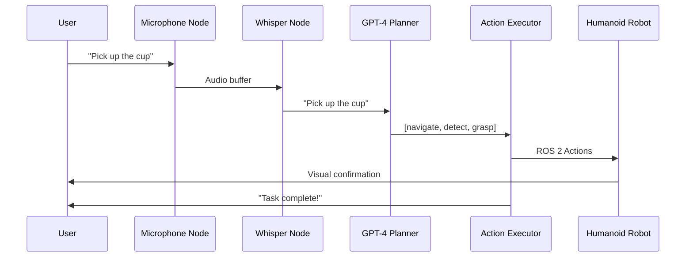

# Voice-to-Action Pipeline - Complete Implementation

## Overview

This guide walks through building a complete **Voice-to-Action (V2A)** system that:
1. Captures voice commands via microphone
2. Transcribes speech using OpenAI Whisper
3. Plans tasks using GPT-4
4. Executes actions via ROS 2
5. Provides visual and audio feedback

## System Architecture



## Step 1: Audio Capture Node

```python
# audio_capture_node.py
import rclpy
from rclpy.node import Node
from std_msgs.msg import ByteMultiArray, Bool
import pyaudio
import numpy as np
import threading

class AudioCaptureNode(Node):
    def __init__(self):
        super().__init__('audio_capture')
        
        # Parameters
        self.declare_parameter('sample_rate', 16000)
        self.declare_parameter('chunk_size', 1024)
        self.declare_parameter('channels', 1)
        
        self.sample_rate = self.get_parameter('sample_rate').value
        self.chunk_size = self.get_parameter('chunk_size').value
        self.channels = self.get_parameter('channels').value
        
        # Publishers
        self.audio_pub = self.create_publisher(
            ByteMultiArray,
            '/audio/raw',
            10
        )
        
        self.is_speaking_pub = self.create_publisher(
            Bool,
            '/audio/is_speaking',
            10
        )
        
        # PyAudio setup
        self.audio = pyaudio.PyAudio()
        self.stream = self.audio.open(
            format=pyaudio.paInt16,
            channels=self.channels,
            rate=self.sample_rate,
            input=True,
            frames_per_buffer=self.chunk_size,
            stream_callback=self.audio_callback
        )
        
        self.stream.start_stream()
        self.get_logger().info('Audio capture started')
        
    def audio_callback(self, in_data, frame_count, time_info, status):
        # Convert to numpy array
        audio_data = np.frombuffer(in_data, dtype=np.int16)
        
        # Detect speech (simple energy-based VAD)
        energy = np.sqrt(np.mean(audio_data**2))
        is_speaking = energy > 500  # Threshold
        
        # Publish audio data
        msg = ByteMultiArray()
        msg.data = in_data
        self.audio_pub.publish(msg)
        
        # Publish speech detection
        speaking_msg = Bool()
        speaking_msg.data = is_speaking
        self.is_speaking_pub.publish(speaking_msg)
        
        return (in_data, pyaudio.paContinue)
        
    def destroy_node(self):
        self.stream.stop_stream()
        self.stream.close()
        self.audio.terminate()
        super().destroy_node()


def main():
    rclpy.init()
    node = AudioCaptureNode()
    rclpy.spin(node)
    node.destroy_node()
    rclpy.shutdown()
```

## Step 2: Whisper Transcription Node

```python
# whisper_node.py
import rclpy
from rclpy.node import Node
from std_msgs.msg import ByteMultiArray, Bool, String
import whisper
import numpy as np
from collections import deque

class WhisperNode(Node):
    def __init__(self):
        super().__init__('whisper_transcription')
        
        # Load model
        self.declare_parameter('model_size', 'base')  # tiny, base, small, medium, large
        model_size = self.get_parameter('model_size').value
        
        self.get_logger().info(f'Loading Whisper model: {model_size}')
        self.model = whisper.load_model(model_size)
        self.get_logger().info('Whisper model loaded')
        
        # Subscribers
        self.audio_sub = self.create_subscription(
            ByteMultiArray,
            '/audio/raw',
            self.audio_callback,
            10
        )
        
        self.speaking_sub = self.create_subscription(
            Bool,
            '/audio/is_speaking',
            self.speaking_callback,
            10
        )
        
        # Publisher
        self.text_pub = self.create_publisher(
            String,
            '/voice/transcription',
            10
        )
        
        # State
        self.audio_buffer = deque(maxlen=160000)  # 10 seconds at 16kHz
        self.is_speaking = False
        self.was_speaking = False
        
    def audio_callback(self, msg):
        # Add to buffer
        audio_chunk = np.frombuffer(msg.data, dtype=np.int16)
        self.audio_buffer.extend(audio_chunk)
        
    def speaking_callback(self, msg):
        self.was_speaking = self.is_speaking
        self.is_speaking = msg.data
        
        # Detect end of speech
        if self.was_speaking and not self.is_speaking:
            self.process_speech()
            
    def process_speech(self):
        if len(self.audio_buffer) < 16000:  # Minimum 1 second
            return
            
        # Convert to float32
        audio_np = np.array(self.audio_buffer, dtype=np.float32) / 32768.0
        
        # Transcribe
        self.get_logger().info('Transcribing...')
        result = self.model.transcribe(
            audio_np,
            language='en',
            task='transcribe'
        )
        
        text = result["text"].strip()
        self.get_logger().info(f'Transcription: "{text}"')
        
        # Publish
        msg = String()
        msg.data = text
        self.text_pub.publish(msg)
        
        # Clear buffer
        self.audio_buffer.clear()


def main():
    rclpy.init()
    node = WhisperNode()
    rclpy.spin(node)
    node.destroy_node()
    rclpy.shutdown()
```

## Step 3: GPT-4 Task Planner Node

```python
# gpt4_planner_node.py
import rclpy
from rclpy.node import Node
from std_msgs.msg import String
from robot_interfaces.msg import ActionSequence, RobotAction
from openai import OpenAI
import json

class GPT4PlannerNode(Node):
    def __init__(self):
        super().__init__('gpt4_planner')
        
        # Get API key from parameter
        self.declare_parameter('openai_api_key', '')
        api_key = self.get_parameter('openai_api_key').value
        
        self.client = OpenAI(api_key=api_key)
        
        # Subscribers
        self.command_sub = self.create_subscription(
            String,
            '/voice/transcription',
            self.command_callback,
            10
        )
        
        # Publishers
        self.plan_pub = self.create_publisher(
            ActionSequence,
            '/robot/action_plan',
            10
        )
        
        self.feedback_pub = self.create_publisher(
            String,
            '/robot/feedback',
            10
        )
        
    def command_callback(self, msg):
        command = msg.data
        self.get_logger().info(f'Planning for: "{command}"')
        
        # Generate plan
        plan = self.generate_plan(command)
        
        # Publish plan
        if plan:
            self.publish_plan(plan)
        else:
            self.publish_feedback("I didn't understand that command.")
            
    def generate_plan(self, command):
        system_prompt = """
You are a humanoid robot task planner. You can perform these actions:

1. navigate_to(location: str) - Move to a location ("kitchen", "living room", etc.)
2. search_for_object(object_name: str) - Look for an object
3. grasp_object(object_name: str) - Pick up an object
4. place_object(location: str) - Put down held object
5. say(text: str) - Speak to the user

Given a user command, generate a JSON array of actions to accomplish it.

Example:
User: "Bring me a cup from the kitchen"
Response: [
  {"action": "navigate_to", "params": {"location": "kitchen"}},
  {"action": "search_for_object", "params": {"object": "cup"}},
  {"action": "grasp_object", "params": {"object": "cup"}},
  {"action": "navigate_to", "params": {"location": "user"}},
  {"action": "place_object", "params": {"location": "table"}},
  {"action": "say", "params": {"text": "Here is your cup"}}
]

Only respond with the JSON array, nothing else.
"""
        
        try:
            response = self.client.chat.completions.create(
                model="gpt-4-turbo-preview",
                messages=[
                    {"role": "system", "content": system_prompt},
                    {"role": "user", "content": command}
                ],
                temperature=0.3
            )
            
            plan_text = response.choices[0].message.content
            plan = json.loads(plan_text)
            
            self.get_logger().info(f'Generated plan with {len(plan)} steps')
            return plan
            
        except Exception as e:
            self.get_logger().error(f'Planning failed: {e}')
            return None
            
    def publish_plan(self, plan):
        msg = ActionSequence()
        
        for step in plan:
            action = RobotAction()
            action.action_type = step["action"]
            action.parameters = json.dumps(step.get("params", {}))
            msg.actions.append(action)
            
        self.plan_pub.publish(msg)
        
    def publish_feedback(self, text):
        msg = String()
        msg.data = text
        self.feedback_pub.publish(msg)
```

## Step 4: Action Executor Node

```python
# action_executor_node.py
import rclpy
from rclpy.node import Node
from rclpy.action import ActionClient
from robot_interfaces.msg import ActionSequence
from nav2_msgs.action import NavigateToPose
from manipulation_msgs.action import GraspObject
import json

class ActionExecutorNode(Node):
    def __init__(self):
        super().__init__('action_executor')
        
        # Action clients
        self.nav_client = ActionClient(self, NavigateToPose, 'navigate_to_pose')
        
        # Subscribers
        self.plan_sub = self.create_subscription(
            ActionSequence,
            '/robot/action_plan',
            self.plan_callback,
            10
        )
        
        self.current_plan = None
        self.current_step = 0
        
    def plan_callback(self, msg):
        self.current_plan = msg.actions
        self.current_step = 0
        self.execute_next_step()
        
    def execute_next_step(self):
        if self.current_step >= len(self.current_plan):
            self.get_logger().info('Plan completed!')
            self.current_plan = None
            return
            
        action = self.current_plan[self.current_step]
        self.get_logger().info(f'Executing: {action.action_type}')
        
        if action.action_type == 'navigate_to':
            self.execute_navigate(json.loads(action.parameters))
        elif action.action_type == 'grasp_object':
            self.execute_grasp(json.loads(action.parameters))
        elif action.action_type == 'say':
            self.execute_say(json.loads(action.parameters))
        else:
            self.get_logger().warn(f'Unknown action: {action.action_type}')
            self.current_step += 1
            self.execute_next_step()
            
    def execute_navigate(self, params):
        location = params['location']
        
        # Look up location pose (simplified)
        pose = self.get_location_pose(location)
        
        # Send navigation goal
        goal_msg = NavigateToPose.Goal()
        goal_msg.pose = pose
        
        future = self.nav_client.send_goal_async(goal_msg)
        future.add_done_callback(self.nav_done_callback)
        
    def nav_done_callback(self, future):
        self.current_step += 1
        self.execute_next_step()
        
    def execute_say(self, params):
        text = params['text']
        # Use TTS system
        self.get_logger().info(f'Robot says: "{text}"')
        self.current_step += 1
        self.execute_next_step()
```

## Step 5: Launch File

```python
# v2a_launch.py
from launch import LaunchDescription
from launch_ros.actions import Node

def generate_launch_description():
    return LaunchDescription([
        # Audio capture
        Node(
            package='voice_to_action',
            executable='audio_capture_node',
            name='audio_capture',
            parameters=[{
                'sample_rate': 16000,
                'chunk_size': 1024
            }]
        ),
        
        # Whisper transcription
        Node(
            package='voice_to_action',
            executable='whisper_node',
            name='whisper',
            parameters=[{
                'model_size': 'base'
            }]
        ),
        
        # GPT-4 planner
        Node(
            package='voice_to_action',
            executable='gpt4_planner_node',
            name='gpt4_planner',
            parameters=[{
                'openai_api_key': 'your-api-key-here'
            }]
        ),
        
        # Action executor
        Node(
            package='voice_to_action',
            executable='action_executor_node',
            name='action_executor'
        )
    ])
```

## Testing the System

```bash
# Build workspace
cd ~/ros2_ws
colcon build --packages-select voice_to_action

# Source
source install/setup.bash

# Launch
ros2 launch voice_to_action v2a_launch.py

# Monitor transcriptions
ros2 topic echo /voice/transcription

# Monitor plans
ros2 topic echo /robot/action_plan
```

## Improvements

### Add Confirmation

```python
def command_callback(self, msg):
    command = msg.data
    
    # Confirm understanding
    confirmation = f"I will {command.lower()}. Is that correct?"
    self.publish_feedback(confirmation)
    
    # Wait for "yes" or "no"
    # Then generate plan
```

### Add Context Memory

```python
class GPT4PlannerNode(Node):
    def __init__(self):
        # ...
        self.conversation_history = []
        
    def generate_plan(self, command):
        self.conversation_history.append({
            "role": "user",
            "content": command
        })
        
        response = self.client.chat.completions.create(
            model="gpt-4",
            messages=[
                {"role": "system", "content": system_prompt},
                *self.conversation_history
            ]
        )
        
        # Store response
        self.conversation_history.append({
            "role": "assistant",
            "content": response.choices[0].message.content
        })
```

## Security Considerations

> [!CAUTION]
> **API Key Security**: Never hardcode API keys. Use environment variables or ROS 2 parameters with proper file permissions.

```bash
# Store API key securely
export OPENAI_API_KEY="sk-..."

# Pass to node
ros2 run voice_to_action gpt4_planner_node --ros-args -p openai_api_key:=$OPENAI_API_KEY
```

> [!WARNING]
> **Command Validation**: Always validate LLM outputs before execution:
```python
# Whitelist of allowed actions
ALLOWED_ACTIONS = ['navigate_to', 'grasp_object', 'place_object', 'say']

for action in plan:
    if action['action'] not in ALLOWED_ACTIONS:
        raise ValueError(f"Invalid action: {action['action']}")
```

## Next Steps

- **[Course Outline](../week-by-week/outline.md)** - Review 13-week schedule
- **Capstone Project**: Build autonomous humanoid with V2A
- **Advanced**: Add error recovery and multi-turn conversations

## Resources

- [OpenAI Whisper](https://github.com/openai/whisper)
- [OpenAI API Docs](https://platform.openai.com/docs/api-reference)
- [PyAudio Documentation](https://people.csail.mit.edu/hubert/pyaudio/docs/)
